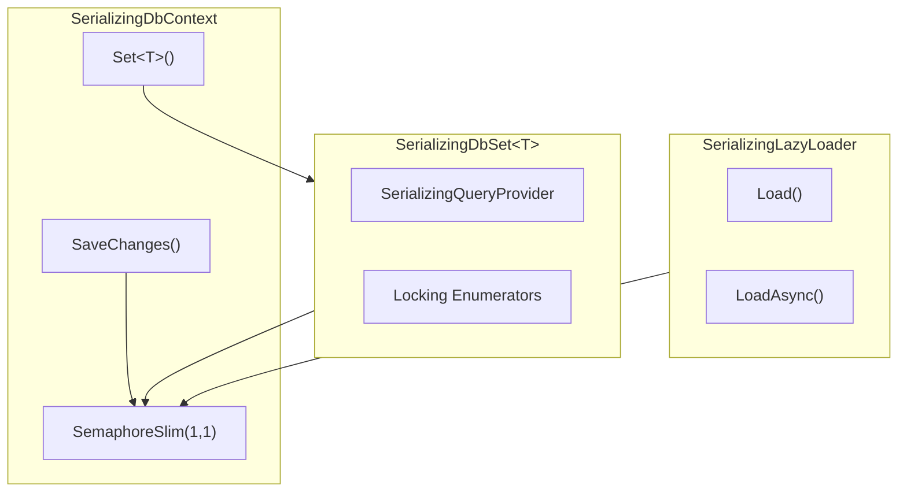

# Blazor DbContext Concurrency Repro & Solution

This project demonstrates and solves the concurrent DbContext access issue in Blazor Server applications (related to [dotnet/aspnetcore#54616](https://github.com/dotnet/aspnetcore/issues/54616)).

## The Problem

In Blazor Server apps:
- While execution is single-threaded (runs inside a synchronization context), multiple components doing async work can **interleave their renderings**
- This can trigger DB calls before previous calls have finished
- This causes the error: `"A second operation was started on this context instance before a previous operation completed"`

Even when using `IDbContextFactory<T>` as recommended, the EF Core DbContext is not thread-safe and concurrent operations cause errors.

## The Solution: SerializingDbContext

This solution provides a comprehensive approach that serializes all DbContext operations, **including lazy loading**. It consists of several cooperating classes:

### Architecture Overview



### Key Files

| File | Purpose |
|------|---------|
| `Data/Serialization/SerializingDbContext.cs` | Base DbContext class with automatic serialization |
| `Data/Serialization/SerializingDbSet.cs` | DbSet wrapper that serializes all query operations |
| `Data/Serialization/SerializingQueryProvider.cs` | Query provider wrapper for async execution |
| `Data/Serialization/SerializingQueryable.cs` | Queryable wrappers maintaining the provider chain |
| `Data/Serialization/ImmediatelyLockingQueryableEnumerator.cs` | Enumerator that holds semaphore until DisposeAsync |
| `Data/Serialization/ImmediatelyLockingAsyncEnumerable.cs` | Async enumerable/enumerator for ToListAsync scenarios |
| `Data/Serialization/DeferredLockingAsyncEnumerator.cs` | Deferred enumerator for DbSet.GetAsyncEnumerator |
| `Data/Serialization/SerializingLazyLoader.cs` | Custom `ILazyLoader` for lazy loading support |

### Step 1: Add the Infrastructure Classes

Copy the `Data/Serialization/` folder into your project. It contains:
- `SerializingDbContext.cs` - Base DbContext with semaphore
- `SerializingDbSet.cs` - DbSet wrapper
- `SerializingQueryProvider.cs` - Query provider wrapper
- `SerializingQueryable.cs` - Queryable wrappers
- `ImmediatelyLockingQueryableEnumerator.cs` - Queryable enumerator
- `ImmediatelyLockingAsyncEnumerable.cs` - Async enumerable/enumerator
- `DeferredLockingAsyncEnumerator.cs` - Deferred enumerator
- `SerializingLazyLoader.cs` - Lazy loading support

### Step 2: Inherit from SerializingDbContext

Change your DbContext to inherit from `SerializingDbContext` instead of `DbContext`. Add a using statement for the Serialization namespace:

```csharp
// Before:
public class AppDbContext : DbContext
{
    public DbSet<Todo> Todos { get; set; }
    public DbSet<Category> Categories { get; set; }
}

// After:
using YourNamespace.Data.Serialization;  // Add this using statement

public class AppDbContext : SerializingDbContext
{
    public AppDbContext(DbContextOptions<AppDbContext> options) : base(options) { }
    
    public DbSet<Todo> Todos { get; set; }
    public DbSet<Category> Categories { get; set; }
}
```

### Step 3: Configure Services in Program.cs

```csharp
using YourNamespace.Data.Serialization;  // Add this for SerializingLazyLoader

// Enable MARS in your connection string (required for lazy loading)
var connectionString = "Server=(localdb)\\mssqllocaldb;Database=MyApp;Trusted_Connection=True;MultipleActiveResultSets=true";

// Configure DbContext with lazy loading proxies and custom lazy loader
builder.Services.AddDbContext<AppDbContext>(options =>
{
    options.UseSqlServer(connectionString)
        .UseLazyLoadingProxies()
        .ReplaceService<ILazyLoader, SerializingLazyLoader>();
});
```

### Step 4: Use in Components

Use DbContext normally in your Blazor components. The serialization is transparent.

---

## The Demo Application

The sample application demonstrates several concurrent database access patterns that would fail without serialization.

### Entry Point: Home.razor

The home page (`Components/Pages/Home.razor`) hosts four component instances that all share the same scoped `AppDbContext`:

```razor
@page "/"
@rendermode InteractiveServer

<div class="row">
    <div class="col-md-6">
        <TodoList @ref="_todoList1" ComponentId="1" />
    </div>
    <div class="col-md-6">
        <TodoList @ref="_todoList2" ComponentId="2" />
    </div>
</div>

<div class="row">
    <div class="col-md-6">
        <CategoryList @ref="_categoryList1" ComponentId="1" />
    </div>
    <div class="col-md-6">
        <CategoryList @ref="_categoryList2" ComponentId="2" />
    </div>
</div>
```

A "Refresh All" button triggers all four components to load data simultaneously using `Task.WhenAll`:

```csharp
private async Task RefreshAllAsync()
{
    var tasks = new List<Task>();
    
    if (_todoList1 != null) tasks.Add(_todoList1.RefreshAsync());
    if (_todoList2 != null) tasks.Add(_todoList2.RefreshAsync());
    if (_categoryList1 != null) tasks.Add(_categoryList1.RefreshAsync());
    if (_categoryList2 != null) tasks.Add(_categoryList2.RefreshAsync());
    
    await Task.WhenAll(tasks);
}
```

### TodoList.razor: Queries with Lazy Loading

The `TodoList` component demonstrates async queries followed by lazy loading:

```razor
@inject AppDbContext Context

@code {
    private async Task LoadDataAsync()
    {
        // Query todos without eager loading
        _todos = await Context.TodoItems
            .OrderBy(t => t.Id)
            .ToListAsync();
        
        // Access navigation property to trigger lazy loading
        foreach (var todo in _todos)
        {
            _ = todo.Category?.Name;  // Lazy load happens here
        }
    }
}
```

This pattern exercises:
1. **Async query execution** via `ToListAsync()`
2. **Lazy loading** when accessing `todo.Category`

### TodoList.razor: Updates with SaveChanges

The same component also demonstrates write operations:

```razor
@code {
    private async Task ToggleTodo(int todoId)
    {
        // Find the entity
        var todo = await Context.TodoItems.FindAsync(todoId);
        if (todo != null)
        {
            // Modify and save
            todo.IsCompleted = !todo.IsCompleted;
            await Context.SaveChangesAsync();
        }
        
        // Reload data
        await LoadDataAsync();
    }
}
```

This exercises:
1. **FindAsync** - single entity lookup
2. **SaveChangesAsync** - write operation
3. **Subsequent queries** - loading fresh data after changes

### CategoryList.razor: Collection Navigation Properties

The `CategoryList` component demonstrates lazy loading of collection navigation properties:

```razor
@inject AppDbContext Context

@code {
    private async Task LoadDataAsync()
    {
        _categories = await Context.Categories
            .OrderBy(c => c.Name)
            .ToListAsync();
        
        // Access collection navigation property
        foreach (var category in _categories)
        {
            _ = category.TodoItems.Count;  // Lazy loads the collection
        }
    }
}
```

### Concurrent Access Pattern

When the page loads or "Refresh All" is clicked:

1. All four components call their `LoadDataAsync()` methods concurrently
2. Each method issues a query (`ToListAsync`) and then triggers lazy loading
3. Without serialization, this causes "A second operation was started" errors
4. With `SerializingDbContext`, operations queue up and execute one at a time
5. All components load successfully

---

## How It Works

### SerializingDbContext

`SerializingDbContext` is a base class you inherit from instead of `DbContext`. It owns a `SemaphoreSlim(1,1)` that serializes all database operations.

When you call `Set<T>()` to get a DbSet, the base class intercepts this and returns a `SerializingDbSet<T>` wrapper instead of the raw DbSet. This wrapper ensures all query operations go through the semaphore. Similarly, `SaveChanges()` and `SaveChangesAsync()` are overridden to acquire the semaphore before executing.

All paths to the database—queries, saves, and lazy loading—flow through the same semaphore. This ensures only one operation executes at a time, preventing the "second operation started" error.

### SerializingDbSet

`SerializingDbSet<T>` wraps the real `DbSet<T>` and intercepts all LINQ operations. LINQ queries are lazily evaluated—when you write `.Where(...).OrderBy(...)`, nothing executes until you enumerate the results (via `ToListAsync()`, `foreach`, etc.).

To handle this, `SerializingDbSet` provides a custom `IQueryProvider` (`SerializingQueryProvider`) that wraps query execution. When EF Core executes a query, the provider:

1. Acquires the semaphore before the query starts
2. Holds the semaphore while results stream from the database (the DataReader is open)
3. Releases the semaphore after enumeration completes or the enumerator is disposed

The third point is important. SQL Server connections cannot have multiple open DataReaders simultaneously. If the semaphore were released when `MoveNextAsync()` returns false (end of results), another query could start before the DataReader is properly closed. Instead, the semaphore is released in `DisposeAsync()`, which the `await foreach` pattern calls automatically.

### SerializingLazyLoader

Lazy loading is triggered synchronously when you access a navigation property (e.g., `todo.Category`). The `SerializingLazyLoader` replaces EF Core's default lazy loader and acquires the same semaphore used by queries.

Since lazy loading is synchronous, it uses `semaphore.Wait()` rather than `WaitAsync()`. This works because all async operations in the serialization classes use `ConfigureAwait(false)`, allowing their continuations to complete on thread pool threads even if the synchronization context is blocked.

### Execution Flow

When multiple Blazor components trigger database operations concurrently:

1. Component A calls `ToListAsync()` → acquires semaphore → query executes
2. Component B calls `ToListAsync()` → waits for semaphore
3. Component A finishes enumeration → disposes enumerator → releases semaphore
4. Component B acquires semaphore → query executes
5. Both components complete successfully, with operations serialized

---

## Project Structure

```
├── Data/
│   ├── AppDbContext.cs              # Your DbContext (inherits SerializingDbContext)
│   └── Serialization/
│       ├── SerializingDbContext.cs              # Base class with serialization
│       ├── SerializingDbSet.cs                  # DbSet wrapper
│       ├── SerializingQueryProvider.cs          # Query provider wrapper
│       ├── SerializingQueryable.cs              # Queryable wrappers
│       ├── ImmediatelyLockingQueryableEnumerator.cs  # Queryable enumerator
│       ├── ImmediatelyLockingAsyncEnumerable.cs # Async enumerable/enumerator
│       ├── DeferredLockingAsyncEnumerator.cs    # Deferred enumerator
│       └── SerializingLazyLoader.cs             # Lazy loading support
├── Components/
│   ├── TodoList.razor               # Component loading todos
│   ├── CategoryList.razor           # Component loading categories  
│   └── Pages/
│       └── Home.razor               # Main page with multiple components
└── Program.cs                       # Service configuration
```

## Running the Demo

```bash
dotnet run
```

Navigate to the URL shown in the console.

The page shows:
- 2 TodoList components and 2 CategoryList components
- Each component loads data and accesses navigation properties (lazy loading)
- Click "Refresh All Components Simultaneously" to trigger concurrent loads
- All operations complete successfully, serialized automatically

---

## Benefits Over Alternative Approaches

- Eliminates concurrent access errors completely
- Supports lazy loading (most solutions don't)
- Works transparently with existing LINQ code
- No changes needed to component code
- Handles all operation types (queries, saves, lazy loads)

---

## Alternative Approaches

1. **Disable lazy loading**: Use eager loading (`.Include()`) for all navigation properties. Requires knowing upfront what data you need.

2. **DbCommandInterceptor**: Serialize at the command level. Simpler but doesn't handle all EF Core scenarios properly.

3. **Explicit synchronization**: Use `SemaphoreSlim` manually in each component. Error-prone and repetitive.

---

## Requirements

- .NET 8.0 or later
- EF Core 8.0 or later
- MARS enabled in connection string for SQL Server
- `Microsoft.EntityFrameworkCore.Proxies` package for lazy loading

## References

- [Blazor and EF Core Guidance](https://learn.microsoft.com/en-us/aspnet/core/blazor/blazor-ef-core)
- [EF Core Lazy Loading](https://learn.microsoft.com/en-us/ef/core/querying/related-data/lazy)
- [GitHub Issue #54616](https://github.com/dotnet/aspnetcore/issues/54616)
