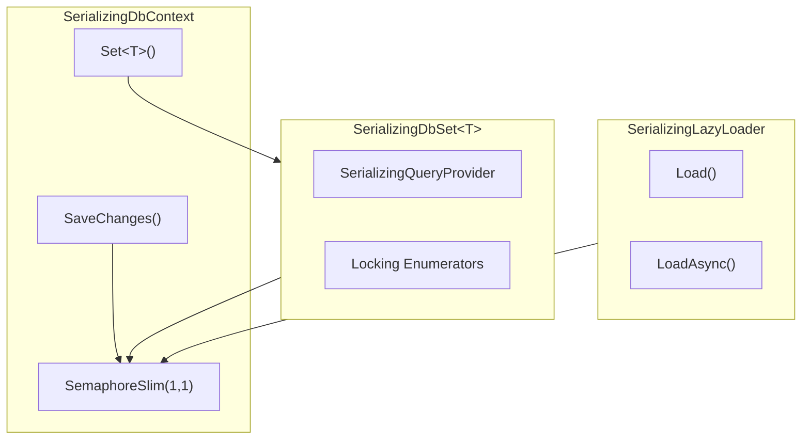

# Blazor DbContext Concurrency Repro & Solution

This project demonstrates and solves the concurrent DbContext access issue in Blazor Server applications (related to [dotnet/aspnetcore#54616](https://github.com/dotnet/aspnetcore/issues/54616)).

## The Problem

In Blazor Server apps:
- While execution is single-threaded (runs inside a synchronization context), multiple components doing async work can **interleave their renderings**
- This can trigger DB calls before previous calls have finished
- This causes the error: `"A second operation was started on this context instance before a previous operation completed"`

Even when using `IDbContextFactory<T>` as recommended, the EF Core DbContext is not thread-safe and concurrent operations cause errors.

## The Solution: SerializingDbContext

This solution provides a comprehensive approach that serializes all DbContext operations, **including lazy loading**. It consists of several cooperating classes:

### Architecture Overview



### Key Files

| File | Purpose |
|------|---------|
| `Data/Serialization/SerializingDbContext.cs` | Base DbContext class with automatic serialization |
| `Data/Serialization/SerializingDbSet.cs` | DbSet wrapper that serializes all query operations |
| `Data/Serialization/SerializingQueryProvider.cs` | Query provider wrapper for async execution |
| `Data/Serialization/SerializingQueryable.cs` | Queryable wrappers maintaining the provider chain |
| `Data/Serialization/ImmediatelyLockingQueryableEnumerator.cs` | Enumerator that holds semaphore until DisposeAsync |
| `Data/Serialization/ImmediatelyLockingAsyncEnumerable.cs` | Async enumerable/enumerator for ToListAsync scenarios |
| `Data/Serialization/DeferredLockingAsyncEnumerator.cs` | Deferred enumerator for DbSet.GetAsyncEnumerator |
| `Data/Serialization/SerializingLazyLoader.cs` | Custom `ILazyLoader` for lazy loading support |

### Step 1: Add the Infrastructure Classes

Copy the `Data/Serialization/` folder into your project. It contains:
- `SerializingDbContext.cs` - Base DbContext with semaphore
- `SerializingDbSet.cs` - DbSet wrapper
- `SerializingQueryProvider.cs` - Query provider wrapper
- `SerializingQueryable.cs` - Queryable wrappers
- `ImmediatelyLockingQueryableEnumerator.cs` - Queryable enumerator
- `ImmediatelyLockingAsyncEnumerable.cs` - Async enumerable/enumerator
- `DeferredLockingAsyncEnumerator.cs` - Deferred enumerator
- `SerializingLazyLoader.cs` - Lazy loading support

### Step 2: Inherit from SerializingDbContext

Change your DbContext to inherit from `SerializingDbContext` instead of `DbContext`. Add a using statement for the Serialization namespace:

```csharp
// Before:
public class AppDbContext : DbContext
{
    public DbSet<Todo> Todos { get; set; }
    public DbSet<Category> Categories { get; set; }
}

// After:
using YourNamespace.Data.Serialization;  // Add this using statement

public class AppDbContext : SerializingDbContext
{
    public AppDbContext(DbContextOptions<AppDbContext> options) : base(options) { }
    
    public DbSet<Todo> Todos { get; set; }
    public DbSet<Category> Categories { get; set; }
}
```

### Step 3: Configure Services in Program.cs

```csharp
using YourNamespace.Data.Serialization;  // Add this for SerializingLazyLoader

// Enable MARS in your connection string (required for lazy loading)
var connectionString = "Server=(localdb)\\mssqllocaldb;Database=MyApp;Trusted_Connection=True;MultipleActiveResultSets=true";

// Configure DbContext with lazy loading proxies and custom lazy loader
builder.Services.AddDbContext<AppDbContext>(options =>
{
    options.UseSqlServer(connectionString)
        .UseLazyLoadingProxies()
        .ReplaceService<ILazyLoader, SerializingLazyLoader>();
});
```

### Step 4: Use in Components

Use DbContext normally in your Blazor components. The serialization is transparent:

```razor
@page "/todos"
@inject AppDbContext DbContext

<h3>Todos</h3>
@if (todos == null)
{
    <p>Loading...</p>
}
else
{
    @foreach (var todo in todos)
    {
        <div>
            @todo.Title - @todo.Category?.Name  <!-- Lazy loading works! -->
        </div>
    }
}

@code {
    private List<Todo>? todos;

    protected override async Task OnInitializedAsync()
    {
        // This is automatically serialized with other concurrent operations
        todos = await DbContext.Set<Todo>().ToListAsync();
    }
}
```

---

## How It Works

### SerializingDbContext: The Central Coordinator

`SerializingDbContext` is the heart of this solution. It's a base class you inherit from instead of `DbContext`, and it owns a single `SemaphoreSlim(1,1)` that serializes all database operations.

When you call `Set<T>()` to get a DbSet, the base class intercepts this and returns a `SerializingDbSet<T>` wrapper instead of the raw DbSet. This wrapper ensures all query operations go through the semaphore. Similarly, `SaveChanges()` and `SaveChangesAsync()` are overridden to acquire the semaphore before executing.

The key insight is that **all paths to the database**—queries, saves, and lazy loading—flow through the same semaphore. This guarantees only one operation executes at a time, eliminating the "second operation started" error.

### SerializingDbSet: Wrapping Query Operations

`SerializingDbSet<T>` wraps the real `DbSet<T>` and intercepts all LINQ operations. The challenge is that LINQ queries are lazily evaluated—when you write `.Where(...).OrderBy(...)`, nothing executes until you enumerate the results (via `ToListAsync()`, `foreach`, etc.).

To handle this, `SerializingDbSet` provides a custom `IQueryProvider` (`SerializingQueryProvider`) that wraps query execution. When EF Core finally executes a query, our provider:

1. **Acquires the semaphore** before the query starts
2. **Holds the semaphore** while results stream from the database (the DataReader is open)
3. **Releases the semaphore** only after enumeration completes or the enumerator is disposed

This last point is critical. SQL Server connections can't have multiple open DataReaders simultaneously. If we released the semaphore when `MoveNextAsync()` returns false (end of results), another query could start before the DataReader is properly closed. Instead, we wait for `DisposeAsync()` on the enumerator, which the `await foreach` pattern guarantees will be called.

### SerializingLazyLoader: Handling Navigation Properties

Lazy loading presents a unique challenge: it's triggered synchronously when you access a navigation property (e.g., `todo.Category`). The `SerializingLazyLoader` replaces EF Core's default lazy loader and acquires the same semaphore used by queries.

Since lazy loading is synchronous, it uses `semaphore.Wait()` rather than `WaitAsync()`. This works safely because all async operations in the serialization classes use `ConfigureAwait(false)`, ensuring their continuations don't need the synchronization context and can complete on thread pool threads even if the sync context is blocked.

### The Complete Picture

When multiple Blazor components trigger database operations concurrently:

1. **Component A** calls `ToListAsync()` → acquires semaphore → query executes
2. **Component B** calls `ToListAsync()` → waits for semaphore (queued)
3. **Component A** finishes enumeration → disposes enumerator → releases semaphore
4. **Component B** acquires semaphore → its query executes
5. Both components complete successfully, just serialized instead of concurrent

---

## Project Structure

```
├── Data/
│   ├── AppDbContext.cs              # Your DbContext (inherits SerializingDbContext)
│   └── Serialization/
│       ├── SerializingDbContext.cs              # Base class with serialization
│       ├── SerializingDbSet.cs                  # DbSet wrapper
│       ├── SerializingQueryProvider.cs          # Query provider wrapper
│       ├── SerializingQueryable.cs              # Queryable wrappers
│       ├── ImmediatelyLockingQueryableEnumerator.cs  # Queryable enumerator
│       ├── ImmediatelyLockingAsyncEnumerable.cs # Async enumerable/enumerator
│       ├── DeferredLockingAsyncEnumerator.cs    # Deferred enumerator
│       └── SerializingLazyLoader.cs             # Lazy loading support
├── Components/
│   ├── TodoList.razor               # Component loading todos
│   ├── CategoryList.razor           # Component loading categories  
│   └── Pages/
│       └── Home.razor               # Main page with multiple components
└── Program.cs                       # Service configuration
```

## Running the Demo

```bash
dotnet run
```

Navigate to the URL shown in the console.

The page shows:
- 2 TodoList components and 2 CategoryList components
- Each component loads data and accesses navigation properties (lazy loading)
- Click "Refresh All Components Simultaneously" to trigger concurrent loads
- All operations complete successfully, serialized automatically

---

## Trade-offs

**Pros:**
- ✅ Eliminates concurrent access errors completely
- ✅ **Supports lazy loading** (most solutions don't!)
- ✅ Works transparently with existing LINQ code
- ✅ No changes needed to component code
- ✅ Handles all operation types (queries, saves, lazy loads)

**Cons:**
- ⚠️ Serializes all DB operations (no true parallelism within one DbContext)
- ⚠️ Slight latency increase when multiple operations queue up
- ⚠️ Requires inheriting from `SerializingDbContext`
- ⚠️ Uses `ConfigureAwait(false)` so code after await runs on thread pool

---

## Alternative Approaches

1. **Create DbContext per operation**: Use `IDbContextFactory<T>` and create a new context for each query. Doesn't support lazy loading across operations.

2. **Disable lazy loading**: Use eager loading (`.Include()`) for all navigation properties. Requires knowing upfront what data you need.

3. **DbCommandInterceptor**: Serialize at the command level. Simpler but doesn't handle all EF Core scenarios properly.

4. **Explicit synchronization**: Use `SemaphoreSlim` manually in each component. Error-prone and repetitive.

---

## Requirements

- .NET 8.0 or later
- EF Core 8.0 or later
- MARS enabled in connection string for SQL Server
- `Microsoft.EntityFrameworkCore.Proxies` package for lazy loading

## References

- [Blazor and EF Core Guidance](https://learn.microsoft.com/en-us/aspnet/core/blazor/blazor-ef-core)
- [EF Core Lazy Loading](https://learn.microsoft.com/en-us/ef/core/querying/related-data/lazy)
- [GitHub Issue #54616](https://github.com/dotnet/aspnetcore/issues/54616)
